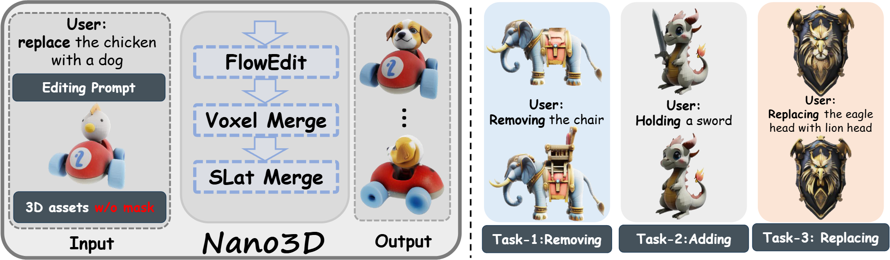
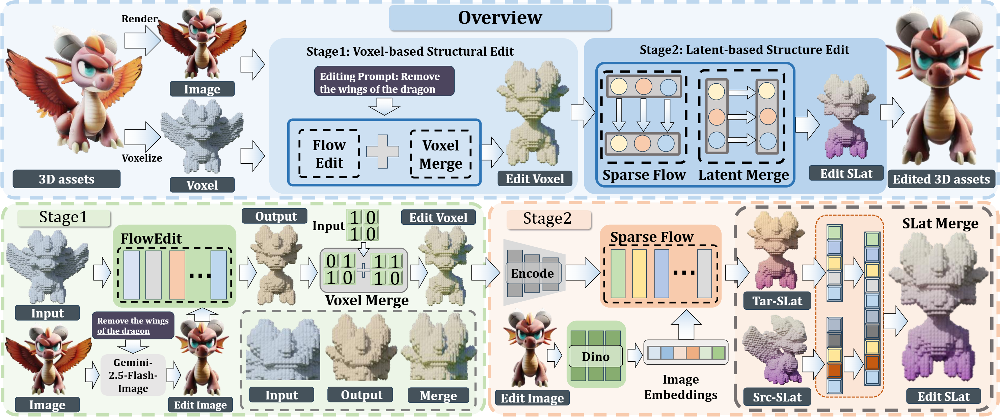
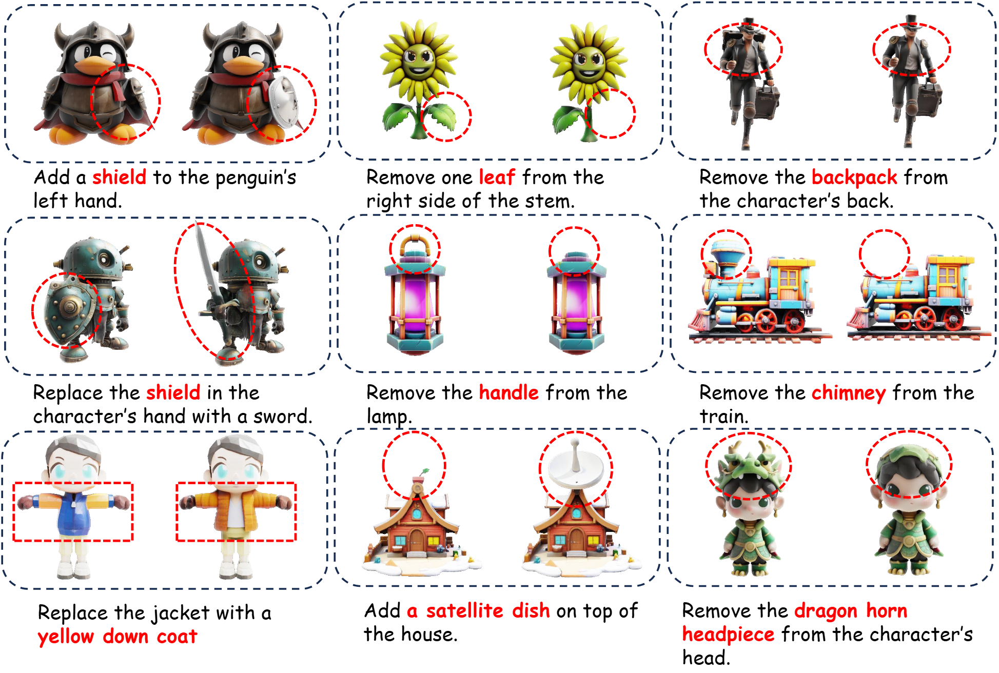

# Nano3D: A Training-Free Approach for Efficient 3D Editing Without Masks

[**Paper**](https://arxiv.org/abs/2510.15019) | [**Project Page**](https://jamesyjl.github.io/Nano3D/) | [**Datasets**](https://huggingface.co/datasets/yejunliang23/Nano3D-Edit-100k)

Official implementation of Nano3D: A Training-Free Approach for Efficient 3D Editing Without Masks

[Junliang Ye*](https://jamesyjl.github.io/), [Shenghao Xie*](https://shxie2020.github.io/), [Ruowen Zhao](https://zhaorw02.github.io/), [Zhengyi Wang](https://thuwzy.github.io/), [Hongyu Yan](https://scholar.google.com/citations?user=TeKnXhkAAAAJ&hl=en&oi=ao), Wenqiang Zu, Lei Ma, [Jun Zhu](https://ml.cs.tsinghua.edu.cn/~jun/index.shtml).

https://github.com/user-attachments/assets/1a382c9f-956b-4501-864d-f2838211b360

Abstract: *3D object editing is essential for interactive content creation in gaming, animation, and robotics, yet current approaches remain inefficient, inconsistent, and often fail to preserve unedited regions. Most methods rely on editing multi-view renderings followed by reconstruction, which introduces artifacts and limits practicality. To address these challenges, we propose **Nano3D**, a training-free framework for precise and coherent 3D object editing without masks. Nano3D integrates FlowEdit into TRELLIS to perform localized edits guided by front-view renderings, and further introduces region-aware merging strategies, Voxel/Slat-Merge, which adaptively preserve structural fidelity by ensuring consistency between edited and unedited areas. Experiments demonstrate that Nano3D achieves superior 3D consistency and visual quality compared with existing methods. Based on this framework, we construct the first large-scale 3D editing datasets **Nano3D-Edit-100k**, which contains over 100,000 high-quality 3D editing pairs. This work addresses long-standing challenges in both algorithm design and data availability, significantly improving the generality and reliability of 3D editing, and laying the groundwork for the development of feed-forward 3D editing models.*

<p align="center">
    
</p>

## Installation

### Basic Environment

Follow the [TRELLIS](https://github.com/microsoft/TRELLIS) installation guide to set up the base environment. Then install the additional dependency:

```bash
pip install bpy==4.0.0 --extra-index-url https://download.blender.org/pypi/
```

### Optional: Local Image Editing with Qwen-Image

If you want to run image editing locally (instead of providing pre-edited images), additional setup is required:

- **torch >= 2.5.1**
- Configure the Qwen-Image environment following the official guide [Qwen-Image-Lightning](https://github.com/ModelTC/Qwen-Image-Lightning)
- **At least 60GB GPU VRAM** is required

Then download the Qwen-Image-Lightning LoRA weights:

```bash
huggingface-cli download lightx2v/Qwen-Image-Lightning \
    Qwen-Image-Edit-2509/Qwen-Image-Edit-2509-Lightning-8steps-V1.0-fp32.safetensors \
    --local-dir ./Qwen-Image-Lightning
```

---

## Gradio Demo

We provide an interactive Gradio interface via `app.py`. There are 4 supported configurations:

| Case | Qwen-Image | Input Type | Description |
|------|-----------|------------|-------------|
| 1 | Enabled | 3D Mesh | Direct 3D editing with auto image editing |
| 2 | Enabled | Image | Image-to-3D, then 3D editing with auto image editing |
| 3 | Disabled | 3D Mesh | Direct 3D editing (provide your own edited image) |
| 4 | Disabled | Image | Image-to-3D, then 3D editing (provide your own edited image) |

**Case 1** — Qwen-Image enabled, input: 3D mesh:
```bash
python3 app.py --use-qwen-image --input-mesh \
    --qwen-image-lora-path "/path/to/Qwen-Image-Edit-2509-Lightning-8steps-V1.0-fp32.safetensors"
```

**Case 2** — Qwen-Image enabled, input: image:
```bash
python3 app.py --use-qwen-image \
    --qwen-image-lora-path "/path/to/Qwen-Image-Edit-2509-Lightning-8steps-V1.0-fp32.safetensors"
```

**Case 3** — Qwen-Image disabled, input: 3D mesh:
```bash
python3 app.py --input-mesh
```

**Case 4** — Qwen-Image disabled, input: image:
```bash
python3 app.py
```

---

## Inference Scripts

Two inference scripts are provided depending on your input type.

### `inference.py` — Input: 3D Mesh

Takes an existing GLB mesh as input and edits it directly.

> **Note on consistency:** When using a 3D mesh as input, editing consistency may be lower. This is a known limitation of TRELLIS's render-projection encoding scheme — as discussed in the Nano3D paper, this pipeline is better suited for constructing editing datasets than for producing high-fidelity interactive edits. If you need more consistent results, you have two options:
> 1. **Use image input instead** (`inference2.py`): the image → 3D → edit pipeline avoids render-projection entirely, yielding more consistent editing pairs. This is how the Nano3D-Edit-100k dataset was built.
> 2. **Stay tuned for Nano3D-v2**, which will address this limitation.

**Case 1** — With Qwen-Image (automatic image editing):
```bash
python3 inference.py \
    --src_mesh_path /path/to/source.glb \
    --output_dir ./output \
    --editing_mode add \
    --using_qwen_image \
    --edit_instruction "add a hat on the head." \
    --lora_path /path/to/Qwen-Image-Edit-2509-Lightning-8steps-V1.0-fp32.safetensors
```

**Case 2** — Without Qwen-Image (provide your own edited image):
```bash
python3 inference.py \
    --src_mesh_path /path/to/source.glb \
    --output_dir ./output \
    --editing_mode add \
    --edit_instruction "" \
    --lora_path ""
```
> Without `--using_qwen_image`, the script will prompt you to enter the path of your pre-edited image.

### `inference2.py` — Input: Image

Takes a single image as input, first reconstructs a 3D mesh via TRELLIS, then performs editing.

**Case 3** — With Qwen-Image (automatic image editing):
```bash
python3 inference2.py \
    --src_input_image_path /path/to/source.png \
    --output_dir ./output \
    --editing_mode add \
    --using_qwen_image \
    --edit_instruction "add a hat on the head." \
    --lora_path /path/to/Qwen-Image-Edit-2509-Lightning-8steps-V1.0-fp32.safetensors
```

**Case 4** — Without Qwen-Image (provide your own edited image):
```bash
python3 inference2.py \
    --src_input_image_path /path/to/source.png \
    --output_dir ./output \
    --editing_mode add \
    --edit_instruction "" \
    --lora_path ""
```
> Without `--using_qwen_image`, the script will prompt you to enter the path of your pre-edited image.

### Arguments

| Argument | Description |
|----------|-------------|
| `--src_mesh_path` | Path to the source GLB mesh (`inference.py` only) |
| `--src_input_image_path` | Path to the source image (`inference2.py` only) |
| `--output_dir` | Directory to save all outputs |
| `--editing_mode` | Editing type: `add`, `remove`, or `replace` |
| `--using_qwen_image` | Flag. Add this argument to enable Qwen-Image for auto image editing; omit it to provide your own edited image |
| `--edit_instruction` | Natural language instruction for Qwen-Image editing |
| `--lora_path` | Path to the Qwen-Image-Lightning LoRA weights |

The output `edit_mesh.glb` will be saved in `--output_dir`.

## Method

Overall Framework of Nano3D. The original 3D object is voxelized and encoded into sparse structure and structured latent respectively. Stage 1 modifies geometry via Flow Transformer with FlowEdit, guided by Nano Banana–edited images. Stage 2 generates structured latents with Sparse Flow Transformer, supporting TRELLIS-inherent appearance editing. Voxel/Slat-Merge further ensures consistency across both stages before decoding the final 3D object.
<p align="center">
    
</p>

## Result

We present three edit types—object removal, addition, and replacement. In each case, Nano3D confines changes to the target region (red dashed circles) and produces view-consistent edits, while leaving the rest of the scene unchanged. Geometry stays sharp and textures remain faithful in unedited areas, with no noticeable artifacts.
<p align="center">
    
</p>

---

## BibTeX

```bibtex
@article{ye2025nano3d,
  title={NANO3D: A Training-Free Approach for Efficient 3D Editing Without Masks},
  author={Ye, Junliang and Xie, Shenghao and Zhao, Ruowen and Wang, Zhengyi and Yan, Hongyu and Zu, Wenqiang and Ma, Lei and Zhu, Jun},
  journal={arXiv preprint arXiv:2510.15019},
  year={2025}
}
```
